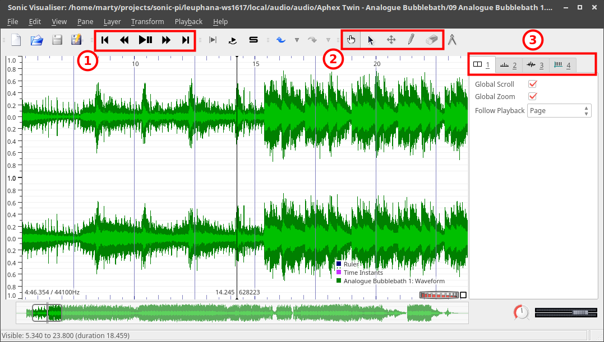

# Sonic Visualiser

Sonic Visualizer ist eine Software, mit der Klangdateien analysiert und annotiert werden können. Das Programm ist als Open Source verfügbar für Windows, OS/X und Linux.

## Download, Plugins und Hilfe

- [Homepage](http://sonicvisualiser.org/)
- [Download](http://sonicvisualiser.org/download.html)
- [Plugins](http://www.vamp-plugins.org/)
  - [Melodische und harmonische Analyse](http://www.isophonics.net/nnls-chroma)
  - [Effekte und Filter (nur Linux)](http://plugin.org.uk/download.php)
- Hilfe
  - [Dokumentation (Englisch)](http://sonicvisualiser.org/documentation.html)
  - [Videos zur Einführung](http://sonicvisualiser.org/videos.html)

## Playback, Werkzeuge und Ebenen

1. Text
2. Text

## Sequenzierung

1. Text
2. Text

1. Text
2. Text

## Annotation

1. Text
2. Text

1. Text
2. Text

## Auswahl und Looping

1. Text
2. Text

## Wiedergabegeschwindigkeit

1. Text
2. Text

## Peak Bins

1. Text
2. Text

1. Text
2. Text

## Equalizer

1. Text
2. Text
