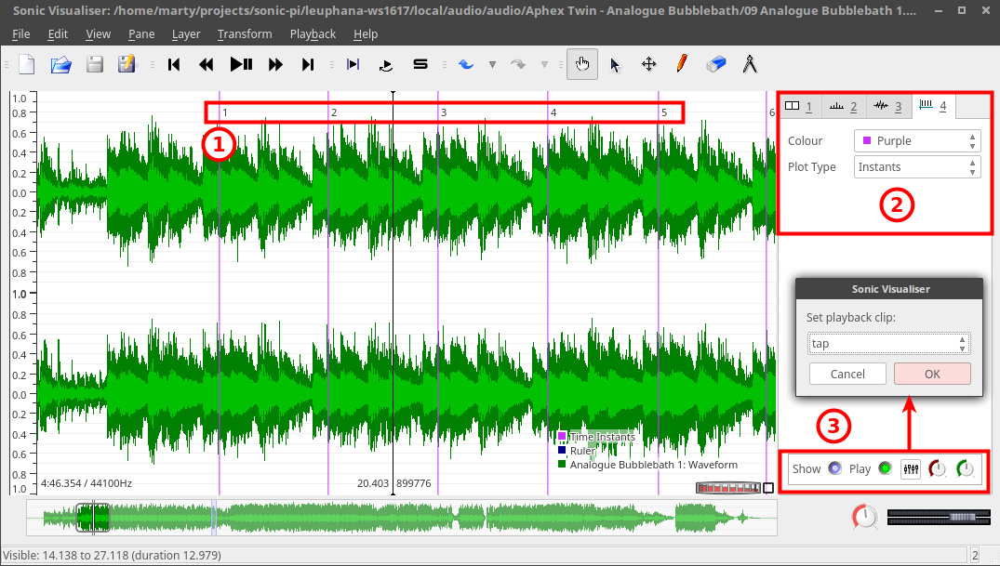
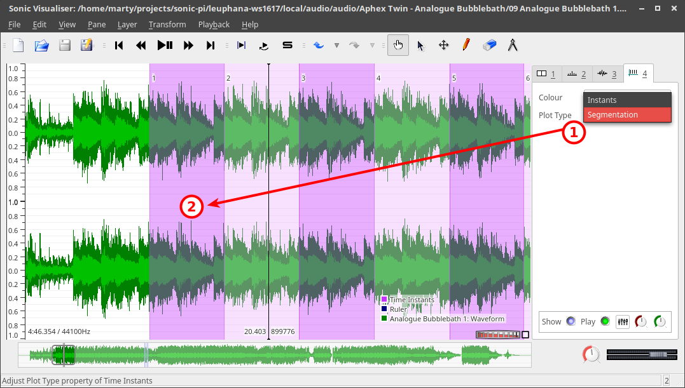
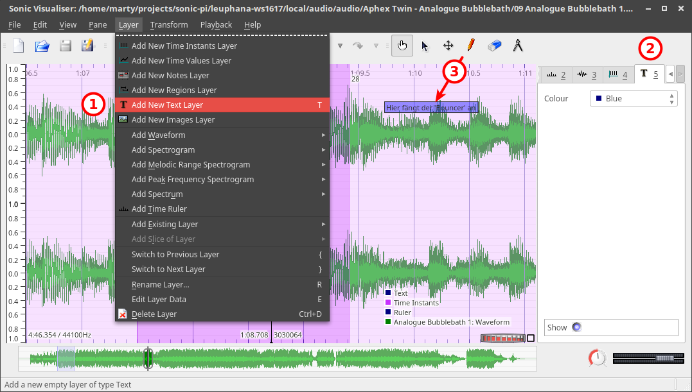
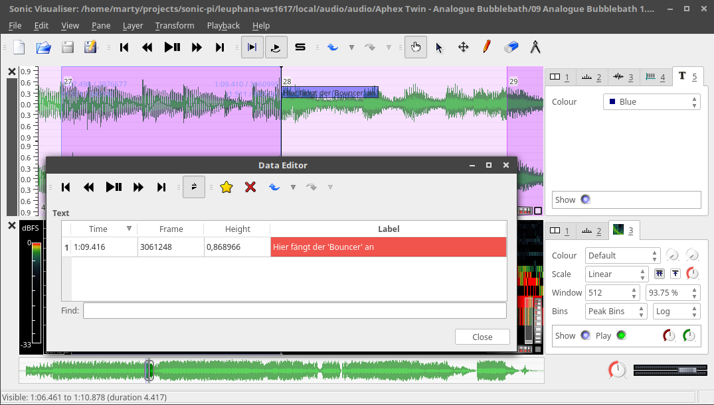
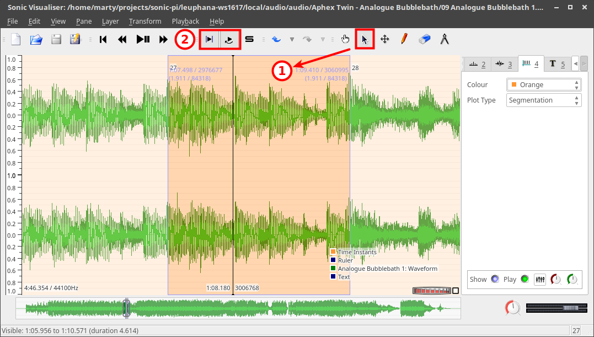
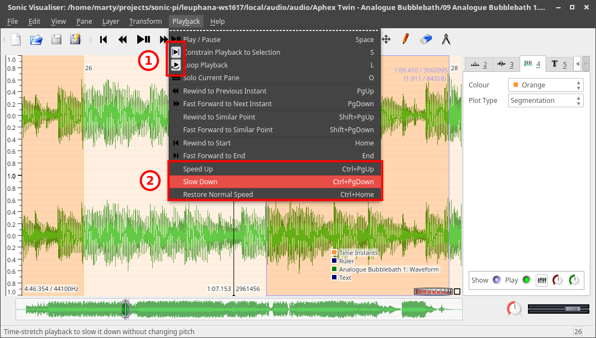
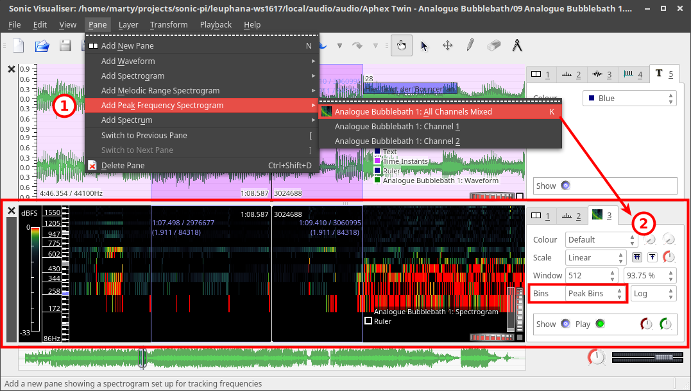
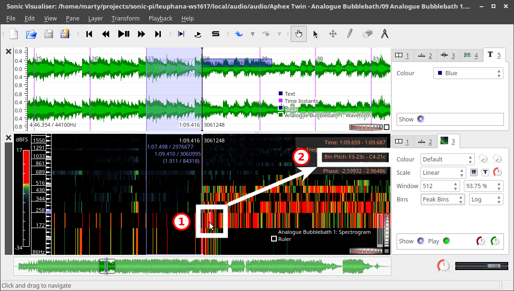
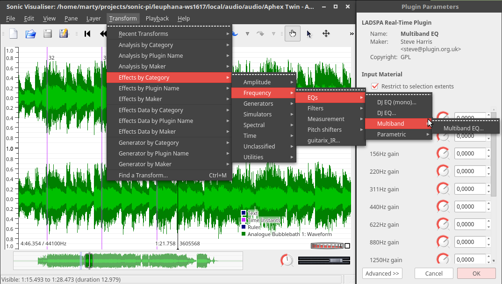

# Sonic Visualiser

Sonic Visualizer ist eine Software, mit der Klangdateien analysiert und annotiert werden können. Das Programm ist als Open Source verfügbar für Windows, OS/X und Linux.

## Download, Plugins und Hilfe

- [Homepage](http://sonicvisualiser.org/)
- [Download](http://sonicvisualiser.org/download.html)
- [Plugins](http://www.vamp-plugins.org/)
  - [Melodische und harmonische Analyse](http://www.isophonics.net/nnls-chroma)
  - [Effekte und Filter (nur Linux)](http://plugin.org.uk/download.php)
- Hilfe
  - [Dokumentation (Englisch)](http://sonicvisualiser.org/documentation.html)
  - [Videos zur Einführung](http://sonicvisualiser.org/videos.html)

## Playback, Werkzeuge und Ebenen

1. Wiedergabesteuerung
2. Werkzeuge
  - Navigation/Verschieben der Time-Line
  - Auswahlwerkzeug
  - Verschieben (z. B. von Text)
  - Editieren (z. B. von Text)
  - Löschen (z. B. von Text)
3. Aktuell anzeigbare Ebenen
  1. Einstellungen für alle Ebenen
  2. Zeitunterteilung
  3. Wellenform
  4. Einteilung in Abschnitte

## Sequenzierung

1. Eingefügte und automatisch numerierte Markierungen bzw. Takte (mit `Enter` oder `;`)
2. Jede Ebene (hier die Unterteilung in Takte) bietet eigene Einstellungen (hier: Farbe und Ansichtsmodus)
3. Die Taktmarkierungen können mit einem rhythmischen Klang hörbar gemacht werden; man kann sie ausblenden oder stummschalten sowie Lautstärke und Position im Stereo-Panorama regeln.

1. Die Ebene mit den Takteinteilung im Modus `Segmentation` und in violett eingefärbt
2. Die Takte werden wechselseitig hell bzw. dunkler gekennzeichnet.

## Annotation

1. Hinzufügen einer Textebene
2. Die Textebene wird blau eingefärbt
3. Textlabels können mit dem Stift eingefügt, mit dem Kreuz verschoben und mit dem Radierer gelöscht werden.

1. Text
2. Text

## Auswahl und Looping

1. Text
2. Text

## Wiedergabegeschwindigkeit

1. Text
2. Text

## Peak Frequency

1. Text
2. Text

1. Text
2. Text

## Equalizer

1. Text
2. Text
